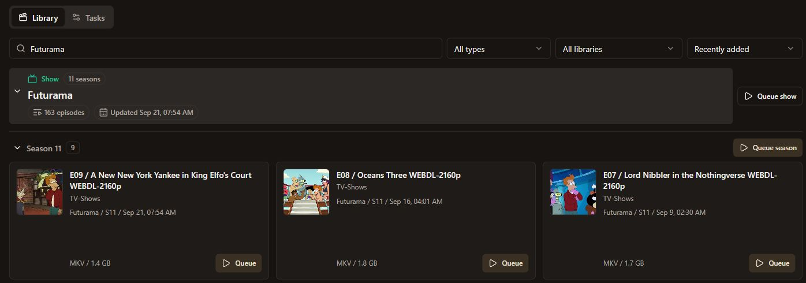
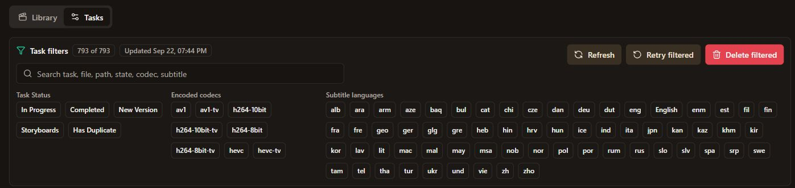

# Sparkle Transcoder

Browse a media library, queue transcodes, and manage the results from a web
dashboard. Sparkle combines a Go backend, a Next.js frontend, and an optional
Windows tray app that keeps the backend running in the background.

- Browse movies and shows with artwork, season grouping, search, and filters.
- Queue individual files, seasons, or whole shows; track, cancel, and retry jobs.
- Encode AV1, HEVC, and H.264, with TV variants for subtitle burn-in and 16:9 padding.
- Extract subtitles and attachments, generate thumbnail storyboards, and access output files.

## A look inside

Browse episodes and queue work at the file, season, or show level.



Find tasks by status, codec, or subtitle language, with controls for batch actions.



## Quick start

Install **Go 1.26+**, **Node.js 20.9+** and npm, plus **FFmpeg**, **FFprobe**,
**MKVToolNix** (`mkvextract`), and **HandBrakeCLI** on the backend's PATH.
Node 22 matches CI and Docker. HandBrake must support your chosen encoder;
NVENC also requires compatible NVIDIA hardware and drivers.

From the repository root, start the backend with your source and output folders:

```powershell
$env:MEDIA_ROOT = "D:\Media"
$env:OUTPUT = "D:\Transcodes"
go run ./cmd/server
```

On macOS or Linux, use `export MEDIA_ROOT=/path/to/media` and
`export OUTPUT=/path/to/transcodes` before the same Go command. The backend
scans on startup; check [its health endpoint](http://localhost:1323/api/health).

In a second terminal, start the dashboard:

```powershell
cd web
npm ci
$env:SPARKLE_API_BASE = "http://localhost:1323/api"
npm run dev
```

On macOS or Linux, use `export SPARKLE_API_BASE=http://localhost:1323/api`.
Open [localhost:3000](http://localhost:3000). For production, use
`npm run build` followed by `npm start` in `web/`.

`SPARKLE_API_BASE` must be reachable from the frontend server and include `/api`.
The frontend proxies browser requests to it at runtime. Restart the frontend
after changing the value; no image rebuild is needed.

## Configuration

The backend reads environment variables; it does not load `.env` files itself.

| Setting | Default | What it controls |
| --- | --- | --- |
| `MEDIA_ROOT` | `./media` | Source library; source files stay unchanged. |
| `OUTPUT` | `./output` | Generated files and saved tasks. |
| `MEDIA_LIBRARIES` | `Movies,TV-Shows` | Library folders under the media root. |
| `API_ADDR` | `:1323` | Backend listen address. |
| `TASK_CONCURRENCY` | `1` | Number of tasks processed at once. |
| `SCAN_INPUT_INTERVAL` | `12h` | Automatic scan interval; `0` disables it. |

See the [configuration reference](docs/reference.md#backend-configuration)
for encoder, tool-path, scan, and storage settings.

On Windows, `launch-backend.ps1` and `launch-frontend.ps1` provide convenience
launchers. Keep machine-specific settings in ignored `*.local.ps1`, `*.local.sh`,
or `*.local.yml` files. The backend and frontend launchers automatically use
their local wrappers when present; `-NoLocalConfig` bypasses them.
See [local setup](docs/reference.md#local-machine-variants) for an example.

**Access:** the API and frontend have no built-in authentication. Keep them on
a trusted network or behind an authenticated proxy. The default API address
binds all interfaces; use `127.0.0.1:1323` for access only from the same PC.

## Other ways to run

**Windows tray:** run `./install-backend-startup.ps1` to build the app and add
Startup and Start Menu shortcuts. Double-click the tray icon for logs; use
**Quit** to stop the backend. The frontend runs separately. Builds require
Windows 10/11 and the Windows .NET Framework C# compiler.
[Tray setup and controls](docs/reference.md#windows-startup-and-tray-launcher).

**Docker frontend:** with the backend running on the host, run:

```sh
docker compose -f docker-compose.frontend.example.yml up -d --build
```

Open port 3000. The example connects to the host backend through
`host.docker.internal:1323`; set `SPARKLE_API_BASE` for a different backend.
The container includes only the frontend.
[Docker and publishing](docs/reference.md#docker-frontend-and-publishing).

To publish, run `bash ./build-frontend-image.sh`. It pushes
`meinya/sparkle-transcoder-frontend` with `latest` and commit tags; set
`IMAGE_NAME` to use another registry destination.

## How jobs behave

- Jobs save metadata and generated files under `OUTPUT/<task-id>/`.
- New tasks require subtitles by default; turn off **Require subtitles** for files without them.
- Startup recovers unfinished jobs. Recovery and retry clear the job's previous output and start over.
- Deleting a task removes its output directory. **Refresh** reloads task changes made outside the app.

See [task behavior](docs/reference.md#scanning-and-task-behavior) and the
[API reference](docs/reference.md#api) for details.

## Development

Backend checks, from the repository root:

```sh
go test ./... -count=1
go vet ./...
```

Frontend checks, from `web/` after `npm ci`:

```sh
npm test
npm run typecheck
npm run build
```

See [AGENTS.md](AGENTS.md) for project structure and contribution guidance, and
[verification details](docs/reference.md#development-and-verification) for race
detection and Windows integration checks.
